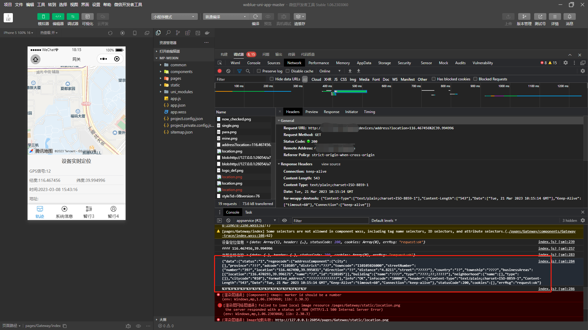

[目录](./)

# 高德地图获得地址时乱码

在小程序中，通过高德地图的 api 获得数据，结果全是乱码。

小程序其他的接口请求都正常，但就高德地图出错。很奇怪。  
虽然应该是高德地图的锅，但还是要调查一下怎么解决问题。

然后发现，返回的数据类型有些奇怪。

好了，问题找到了，只要把返回的 `content-type` 强制指定为 `application/json; charse=utf-8;` 就 OK 了~
只要修改掉后台的代码，不管是 nginx 还是 java 都无所谓。

重新部署之后再去小程序里看一眼

完毕！
