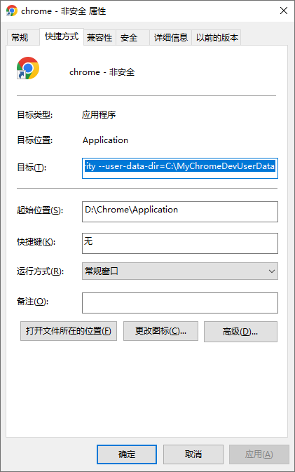

[目录](./)
# 无插件跨域

命令行启动：

```
google-chrome --disable-web-security --user-data-dir=/var/tmp %U
```

Windows 下需要在 Chrome 的快捷方式邮件 => 快捷方式 => 目标里写成这样
```
D:\Chrome\Application\chrome.exe --disable-web-security --user-data-dir=C:\MyChromeDevUserData
```

