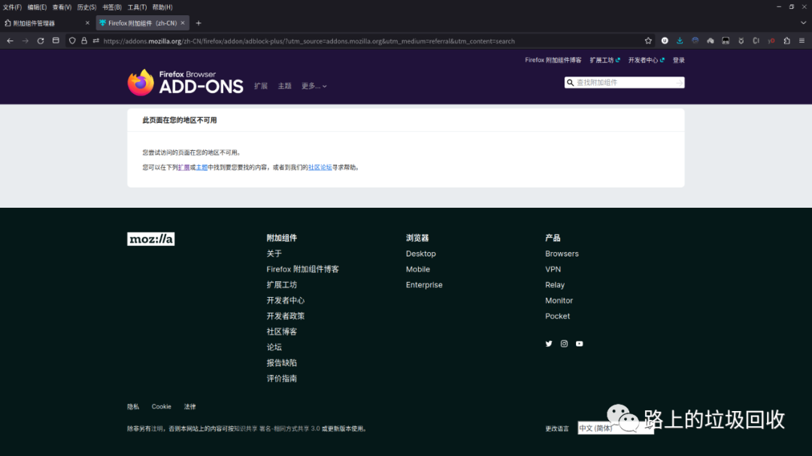
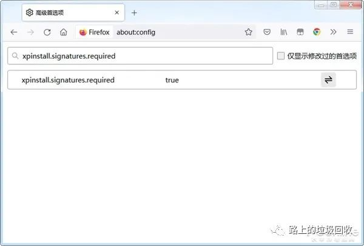
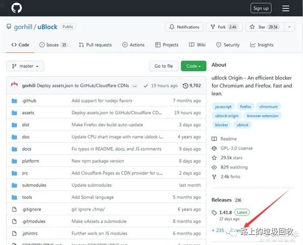
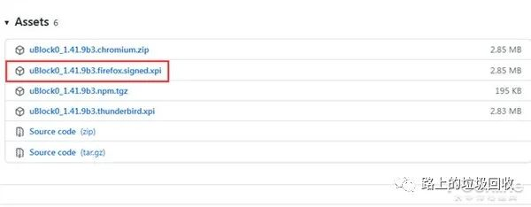
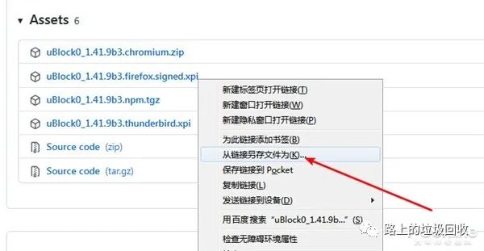
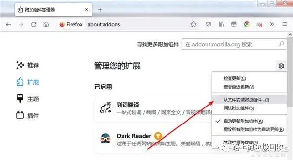

[目录](./)
# 火狐手动安装 uBlock 扩展屏蔽广告

今天上贴吧的时候，突然发现了大面积的网页广告。
瞬间有些疑惑，我浏览器里的 adblock 插件失效了？

然后一看扩展，好家伙，连 adblock 插件本体都消失了~
难道是我自己删了？
于是想着，去火狐官网再安装一下应该就可以了。

然后……

带着疑惑上网搜索，得，看来又是国内各种流媒体干的好事。

骂归骂，但问题还是要解决的。

再次放狗之后，发现了一条大约一年前的一篇文章，转载部分（嗯，一年前？）

> 首先，我们需要确保火狐Firefox开启了自定义安装扩展程序的功能。在地址栏输入“ahout:config”按下回车键，进入到高级首选项界面，然后在其中查找“xpinstall.signatures.required”设置项，确保设置为“true”状态。

> 

> uBlock这款广告屏蔽扩展程序是开源的，想要安装它，我们可以进入到它在GitHub上的开源项目。

> uBlock：https://github.com/gorhill/uBlock

> 在页面上的release一栏，即可进入到uBlock的发布页面。

> 

> 选择一个版本，点开“Assets”，可以看到有对应Firefox的版本，其后缀名为.xpi，点击即可直接安装。

> 

> 除此以外，我们也可以将文件存放到本地，以防不时之需。在对应文件链接点击右键，将.xpi文件存放到本地。

> 

> 要在火狐中安装.xpi文件也很简单。点击火狐Firefox的菜单键，选择“扩展和主题”，进入到扩展程序管理页面。在其中，点击齿轮图标，即可看到“从文件安装附加组件”的选项，选择想要安装的.xpi文件即可。

> 

> 完成安装后，我们可以发现uBlock是可以正常使用的。火狐只是屏蔽了广告拦截扩展的商店页面，并没有阻止这些扩展程序的正常运行。

安装完毕后，刷新贴吧，整个世界都清净了~

