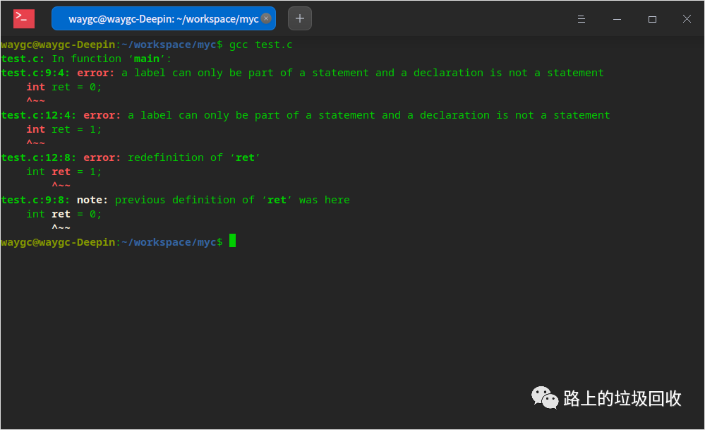

[目录](./)

# 基础啊基础！出在 switch case 上的一个大失败！

最近写 bug 的时候，写到类似下面这样的代码：

```
    module.exports = {
       inputs: [0],
       execute: (input) => {
           switch (input) {
               case 0:
                   let res = {
                       username: "aaaaaa"
                   };
                   break;
               case 1:
                   let res = {
                       username: "bbbbb"
                   };
                   break;
               default:
           }
       }
    }
```

本来是指望两个 res可以各自打想要的结果，互不干扰，但结果却让我意外， node 竟然报了下面的错误：


于是顿感奇怪，在原始代码中排除掉其他任何有可能发生的问题，得到上面的代码后，问题依旧。  
这就奇怪了，自认为两个 case 之间应该是毫无关系的，为什么还会发生这样的错误呢？

于是找来 java 和 c 做验证，还是得到了一样的结果……

```
package test;

public class Test {

   public static void main(String[] args) {

        int in = getInt();

        switch (in) {
            case 0: 

                int a = 1; 
                break; 
            case 1: 
                int a = 23; 
                break; 
            default: 
        } 
    }

    static int getInt() { 
        return 0; 
    }
}
```


```
int getInt();

int main() {

    int in = getInt();

    switch (in) {
        case 0:
            int ret = 0;
            break;
        case 1:
            int ret = 1;
            break;
    }
  
    return 0;
}

int getInt() {
    return 0;
}
```



找基友商量的时候，他的一句话提醒了我。

> {}是一个区间，两个a确实不合适

一想也是。

写了这么多年的 bug ，竟然忘记了这个基础，大失败！


那解决方案呢？

1. 把变量的定义放到 switch case 外面，做成一个全局变量；
2. 就是在每个 case 块里加 {} ，让每个 case 也成为一个个单独的块就可以了


