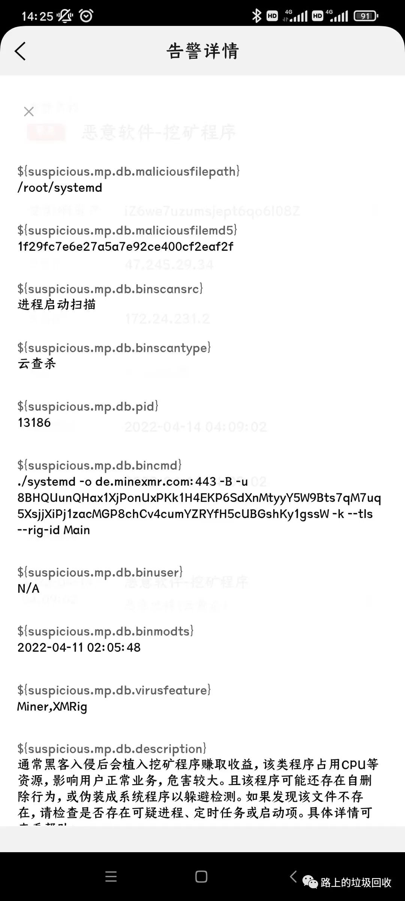

[目录](./)

# 记一次阿里云的安全处理

这几天，连续收到阿里云的安全报警短信，先是提示有挖矿程序，后是提醒有自启动服务。

  

吓得我连忙登陆阿里云后台进行处理。

先去阿里云的控制台里查看报警信息，提示 有个什么 xmrig 的东东。   

还有个 systemd 这么个东东。  

通过 top 命令，查看哪个进程最占用资源，kill 掉进程后，再去 root 目录下删掉 xmirg 、c3pool 、systemd 三个文件（目录）后，世界清静了。  
再去看阿里云控制台的报警信息，异地登陆的 IP，设置安全组禁止掉这两个IP。

  

然后查了一下，这 xmrig 似乎是**门罗币**的挖矿软件，而且入侵进来之后连个名字也不带改的。  
我真心怀疑不会是因为我拒绝购买阿里云的服务，阿里云自己搞的吧……  
最后就是修改 root 的密码，以防万一，甚至连我平时用的账号的密码也一并改了（改的巨复杂，我都记不住 T T）……

然后再在阿里云的处理上全部点选手动处理，这应该好了吧？  
吧？  
吧？

事情到了这里，还是有些小担心，于是去网上搜索了一番阿里云禁止挖矿的操作，照着对照了一遍，自己再执行了一遍，似乎安心了……  
转头再一想，对方都用的 root 用户，那 还是把 root 给禁止远程登录给配置一下吧，于是修改 ssh 的配置，禁止远程登陆 root 。  
现在，似乎可以安心了……

然后就想到了一句以前看到的话来结束话题，觉得很合适。

摘录自《鸟哥的 Linux 私房菜（基础篇）》  
