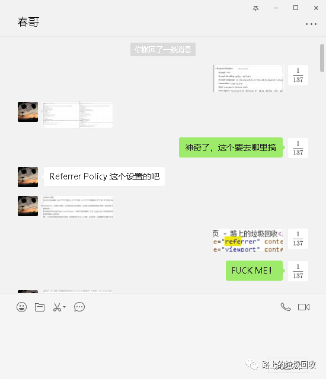
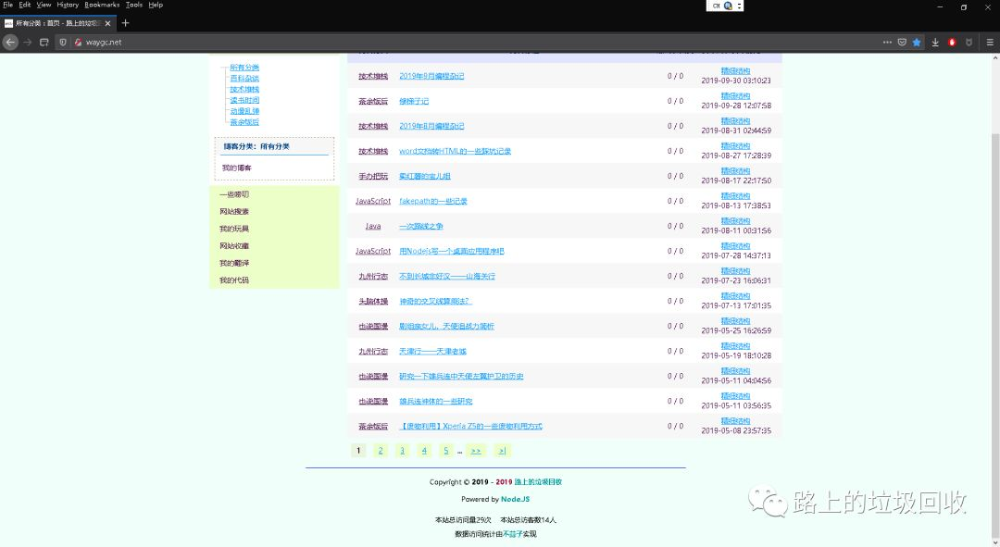

[目录](./)
# 鱼与熊掌不可得兼的数据统计和图片引用（盗链）

起因是这样的，某个基友基于hexo的博客上线了，于是稍微研究了一下，就有了下面的对话。

  


然后就跑去看了看人家的实现，就两行代码，如果要真的可以这么实现，那做网站统计就太爽了。


于是就将其引用到了自己的代码中。  
但是，结果却有些奇怪。不显示任何数据！


但如果采用最简化的HTML代码，则就完全没有任何问题，所以肯定是我自己的页面有问题。  
于是就开始和基友的研究，修改代码。

  
  


原因找到了，删掉这行代码之后，果然好用了～



但接着问题就又来了，就是从微信公众号中引用的全部挂掉了。


原因也很简单，因为微信公众号设置了防盗链，而如果通过网页、js、css等请求，则就会带上`referrer`。  
所以当我需要外连微信公众号的时，就需要加上

```
<meta name="referrer" content="never" />
```

这行代码来“盗链”，但加入了这行代码之后，就阻断了浏览器请求中的“Refer”从而导致在引入计数功能时出错。  
那么接下来的问题就变成了：能不能在阻断引用的时候，给计数的请求单独加上“Refer”。然后看不蒜子的源代码，看来只要自己写一个ajax请求就可以了～  

但是理想很美好，现实很残酷，逼乎上的一个帖子，彻底断了我的念想。  
[https://www.zhihu.com/question/36723766](https://www.zhihu.com/question/36723766)  


最后，为了保证我从微信公众号引用（盗链）的能正常显示，只能舍弃计数功能了。

