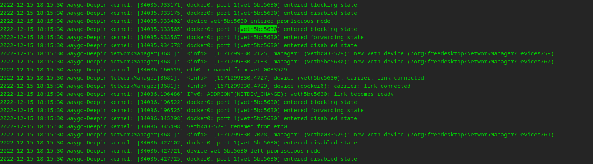

[目录](./)
# 类似 docker0: port 1(veth5bc5630) entered disabled state 的问题

## 现象

在启动 docker 后，通过 `docker ps` 命令看不到 已经启动的 docker ，然后看撞他也是停止的。

再通过 系统日志 `sudo tail -f -n 200 /var/log/messages` 看到 docker 出现了类似下面的错误。



## 解决方案

试过网上各种方法之后都没什么用。  
比如：
* [https://www.yisu.com/zixun/9842.html](https://www.yisu.com/zixun/9842.html)

调试之后发现，可能原因是 docker 启动的时候，命令不对，下面这样就可以正常启动 docker 。

```
docker run -p 8080:8080 -dit my-react-admin-dev sh
```

具体和之前的参数有什么区别，待研究。