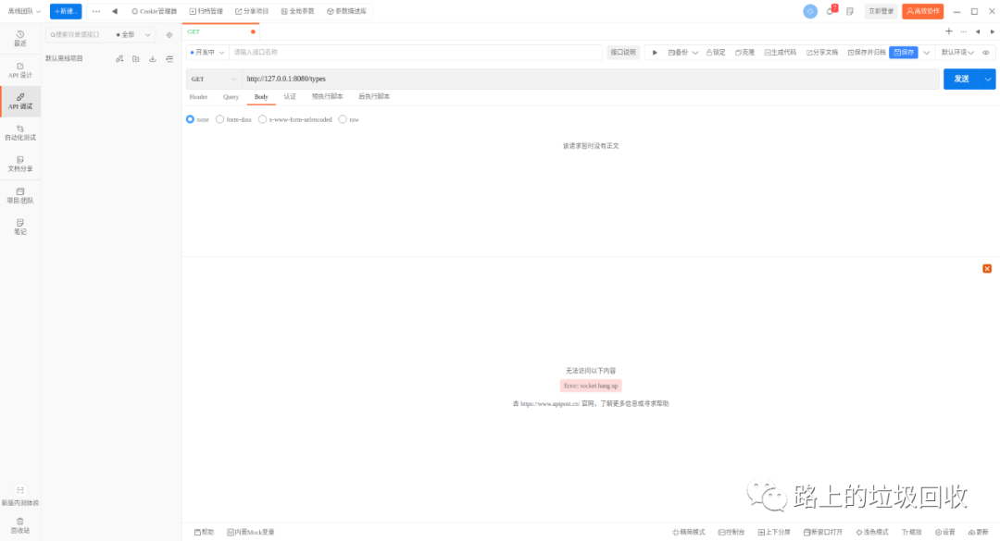
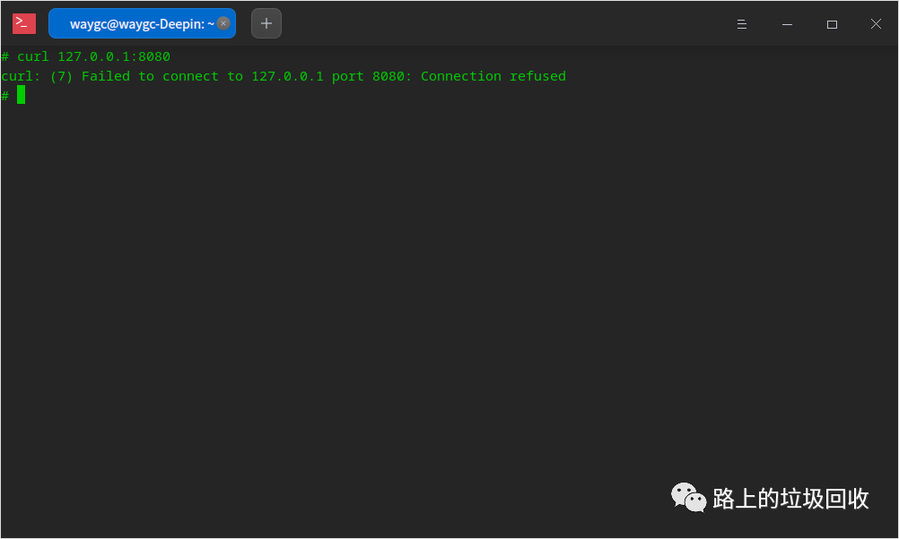
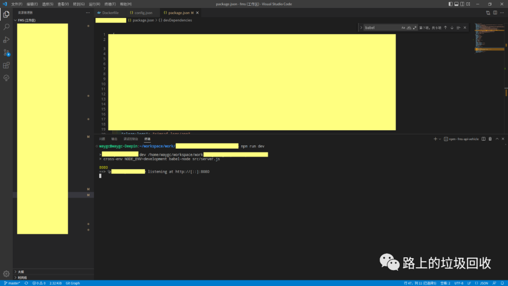
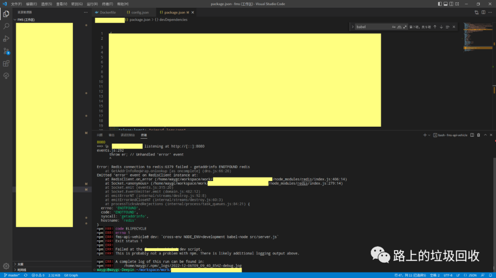
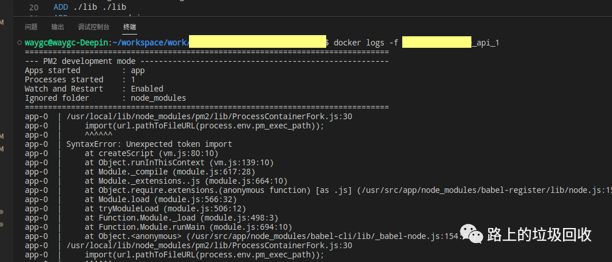
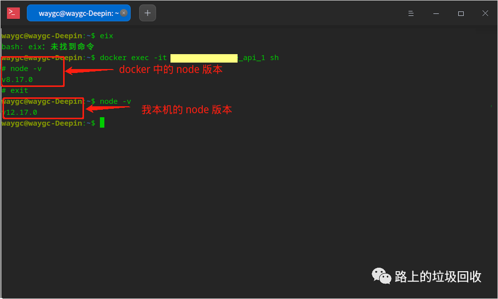
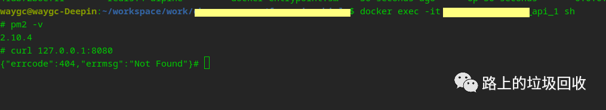

[./目录]

# 记一次docker启动正常，但api无法访问的错误

### 1. 现象

某个项目中，docker正常启动了，但是通过apipost访问接口却无法
访问，显示连接失败。



### 2. 调查

在 docker 中用 curl 也显示 connect 失败。



怀疑 docker 中的 node 服务就没有启动。
而如果在本地启动，则没有问题。



通过 apipost 访问，也出现了结果。



证明代码自身没有问题。
原因很大可能出现在 docker 上。
查看 docker 的日志



发现 docker 日志中，pm2 启动的时候就报错了，似乎 pm2 自身就没有起来。
对比 docker 和我本机，发现 node 的版本不同。



真相大白了？

但根据领导的话，以前原来开发人员打包的docker是可以运行的，而且docker中node的版本就是8.17.0。

所以根源应该不在 node 的版本上，还要继续深挖。

然后想到，既然是 pm2 上出了问题，于是我看了一眼 docker 里的 pm2 的版本号：5.2.2 。

### 3. 结论

docker 里的 pm2 版本太高，导致 node 环境无法编译代码导致整个服务都无法启动。
解决方案

最简单的就是重装 pm2 。

于是在 docker 里面一番折腾之后，让 pm2 退回了 2.10.4，然后用这个版本，所有服务就都正常了。

但新的问题就又来了。  
如果我把 docker 关闭之后 ，再启动，docker 里面我手动修改过的配置全部被抹除了。

所以，接下来的问题，就又变成了怎么修改 docker 的配置，让其自动配置到我想要的状态。

再接下来，发现相关配置都在 dockerfile 中，而且 dockerfile 中有一行

```
RUN npm config set registry https://registry.npm.taobao.org && npm install pm2 -g
```

于是这次是真的破案了。

当年写代码的时候，不写版本号拉下来的 pm2 的版本可能还能适应 8.17.0 的 node。  
但当时间到了现在，不写版本号拉下来的 pm2 的默认版本已经升级到了 5.2.2，8.17.0 的 node 已经无法支持部分语法了，所以就报了错。

那接下来就好办了，只要指定 pm2 的版本就可以了。

```
RUN npm config set registry https://registry.npm.taobao.org && npm install pm2@2.10.4 -g
```

中间对docker的各种研究略过不表，最后删除本地所有的docker镜像，

```
docker rmi -f 镜像ID
```

然后再重新生成本地的镜像。

生成完毕后，再进入docker查看。

