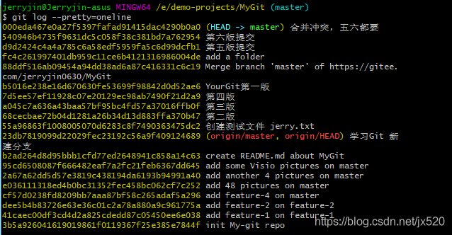
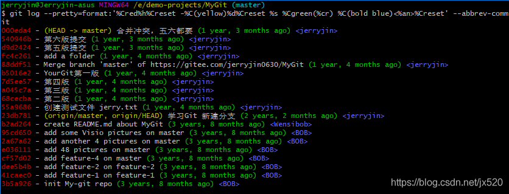
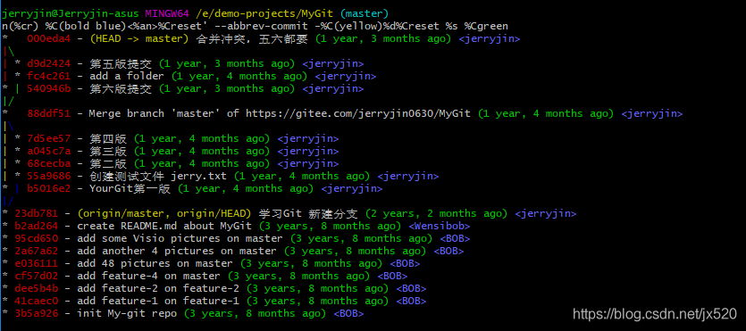
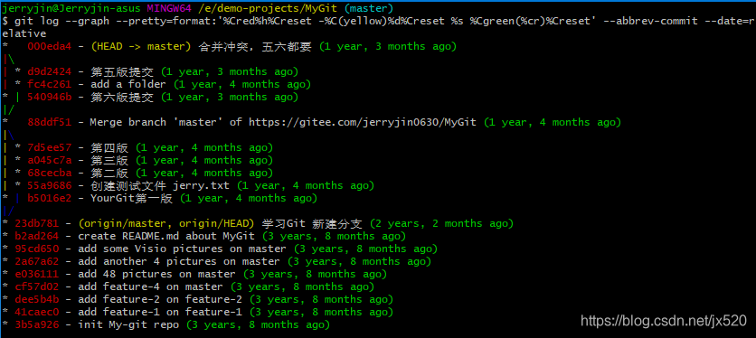

[目录](./)
# Git学习笔记log日志

查看日志是非常高频的命令
清晰的日志，看上去心情好，事半功倍。
主要是设定样式，网上有甚多设置好的，收集一下，备用即可。

# 常用
## 单行

```
git log --pretty=oneline
```

# 图表

```
git log --graph
```


# 自定义格式

```
git log --pretty=format:“格式内容”
```


## 单行

```
git log --pretty=format:'%Cred%h%Creset -%C(yellow)%d%Creset %s %Cgreen(%cr) %C(bold blue)<%an>%Creset' --abbrev-commit
```


## 图表

```
git log --graph --pretty=format:'%Cred%h%Creset -%C(yellow)%d%Creset %s %Cgreen(%cr) %C(bold blue)<%an>%Creset' --abbrev-commit
```


```
git log --graph --pretty=format:'%Cred%h%Creset -%C(yellow)%d%Creset %s %Cgreen(%cr)%Creset' --abbrev-commit --date=relative
```



# 参考资料

* [https://git-scm.com/docs/git-log](https://git-scm.com/docs/git-log)
* [progit/2-Git-基础.html#2.3-查看提交历史](https://gitee.com/progit/2-Git-%E5%9F%BA%E7%A1%80.html#2.3-%E6%9F%A5%E7%9C%8B%E6%8F%90%E4%BA%A4%E5%8E%86%E5%8F%B2)
