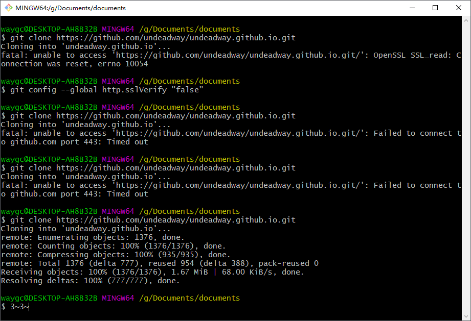

[目录](./)
# Git报错 OpenSSL SSL_read: Connection was reset, errno 10054

> Git报错解决：OpenSSL SSL_read: Connection was reset, errno 10054

今天拉代码的时候，遇到这个问题，搜索了一下，通过以下方式可以解决：
```
git config --global http.sslVerify "false"
```

试了一下，确实可以。



参考：[https://blog.csdn.net/qq_29493173/article/details/114534057](https://blog.csdn.net/qq_29493173/article/details/114534057)