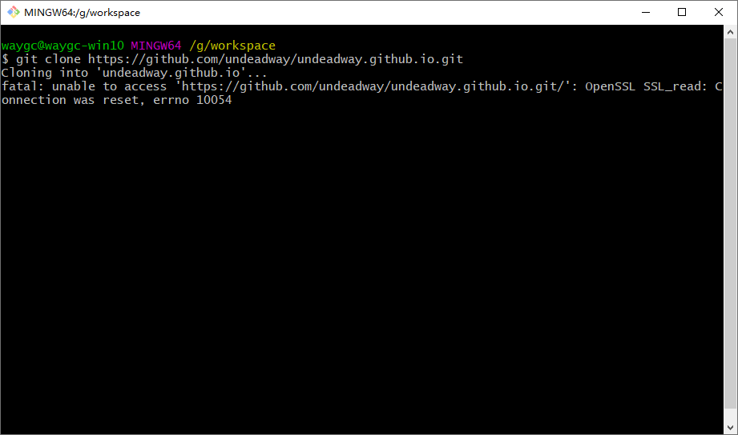

[目录](./)
# git提交或克隆报错fatal: unable to access

### 现象


### 原因
git在拉取或者提交项目时，中间会有git的http和https代理，但是我们本地环境本身就有SSL协议了，所以取消git的https代理即可，不行再取消http的代理。
解决办法：在项目文件夹的命令行窗口执行下面代码，取消git本身的https代理，使用自己本机的代理。

### 解决方案
```
git config --global --unset http.proxy
git config --global --unset https.proxy
```