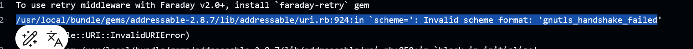

[目录](./)

# git pull报错gnutls_handshake() failed: Error in the pull function

## 正文

在上海一个星期，一直在用 windows 电脑，  
回家开启了好久不用的 Deepin ，然后就报出了上面的错误。

百思不得其解，上星期回家，git 还能用，但今天一回家就报错，不知道为啥……  
甚至还重装了 git 。

然后上网查原因，到一些文章说，这是因为 ssl 的错造成的云云。  
但翻了好多资料，都没找到好的解决方法，要么自己去编译 git ，但我很不想这么去做……  
要么就是说在 Ubuntu 上如何如何……

所以，只能放弃。

但转念一想，SSL 出问题，那我是不是可以用 SSH 呢？  
于是，我把仓库的 clone 命令改成了 SSH 模式。

```
git clone git@gitee.com:undeadway/modell-vue2-frame.git
```

然后就非常顺利地克隆下来了代码、pull 和 push 也都没问题。
于是，这就完了

吗？

接下来就发现，我自己所有node 项目中，在 package.json 中，用到自己的 库，所采用的方式也全是 ssl 模式的，
简单来说，就是写成这样

```
"dependencies": {
	"modell-vue2-frame": "git+https://gitee.com/undeadway/modell-vue2-frame#dev"
}
```

解决方法也很简单，把这里的 https 也改成 ssh 就可以了。

```
"dependencies": {
	"modell-vue2-frame": "git+ssh://git@gitee.com/undeadway/modell-vue2-frame#dev"
}
```

完！

PS1: 不过啥会发生这么个错误，还待调查  
PS2：经过确认，这个问题只发生在我的 Deepin 上

## 续集！

因为写这篇文章，我把更新提交给了 github ，但 过了好久，还是没更新，我开始查错误。

这一查不要紧，查出问题来了。  
github pages build 失败了！


奇而怪之，照着提示开始拍错，又是查 Jekyll ，又是查 github 的配置，怀疑是不是不支持 md 格式了。  
总之没得出一个很好的结果，这时，看到了这么条信息。



尼玛这不就我自己刚遇到的问题么，怎么 github 也有？  
瞬间上头，立刻找朋友吐槽去了。

然后朋友说：你退回几个版本试试。  
我照做了。

然后，编译成功了……

？？？？

我满头问号，开始继续排查问题。
然后就看到了一个让我无语的错误。


我 TM 在文件名里加了个`:` ！  
我 TM 在文件名里加了个`:` ！  
我 TM 在文件名里加了个`:` ！


这时在回头看之前的那个提示


分明就是在告诉我哪里错了。  
因为刚写完自己这篇文章，有点不理智，顿时就被误导了。

哎~

不过最后还是解决了问题。