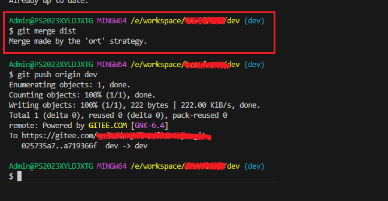

[目录](./)
# Merge made by the 'ort' strategy.

## 现象

今天合并代码的时候，遇到了如题这么一个提示。 
但看 git log，代码似乎又合并成功了。

## 调查

然后在[知乎](https://www.zhihu.com/question/518192414)上看到了一个帖子，知道了大概原因

然后想到，自己这次合并因为是两个版本都做了同样的修改，造成了本地的冲突。  
所以才会有这样的提示（吧？）