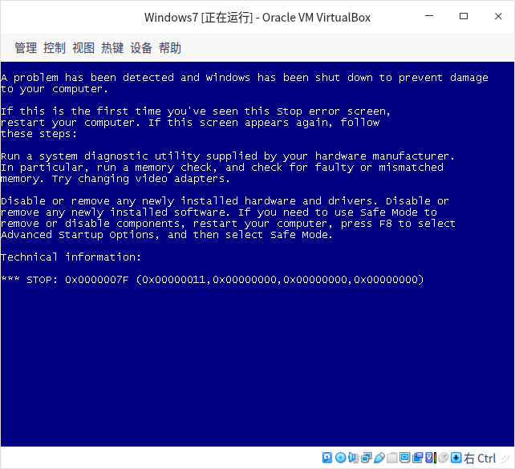
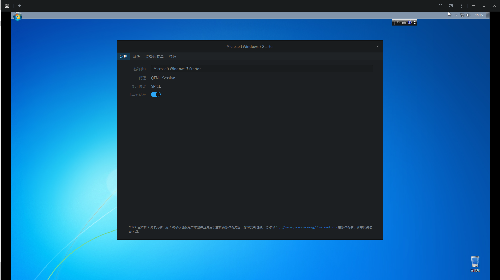

[目录](./)
# VirtualBox出现各种错误

包括 VirtualBox 核心错误等等。

~~删了商店的，用命令行 `sudo apt-get install virtualbox-6.1` 安装就可以了。~~

直接安装官网的版本：`virtualbox-6.1_6.1.22-144080~Debian~buster_amd64.deb`

但安装之后，但启动 Win7 虚拟机的时候，出现内存错误，不知道为什么。

换了好几个 win7 镜像都一样，其他的系统没问题。  
但整个 vb 在用 win10 的时候似乎存在系统容易崩溃，要重启动，具体原因未调查。

**Gnome-boxes 可以用 Win7**

