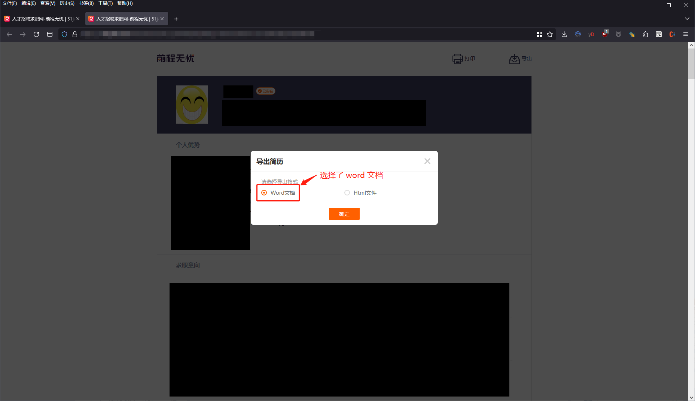
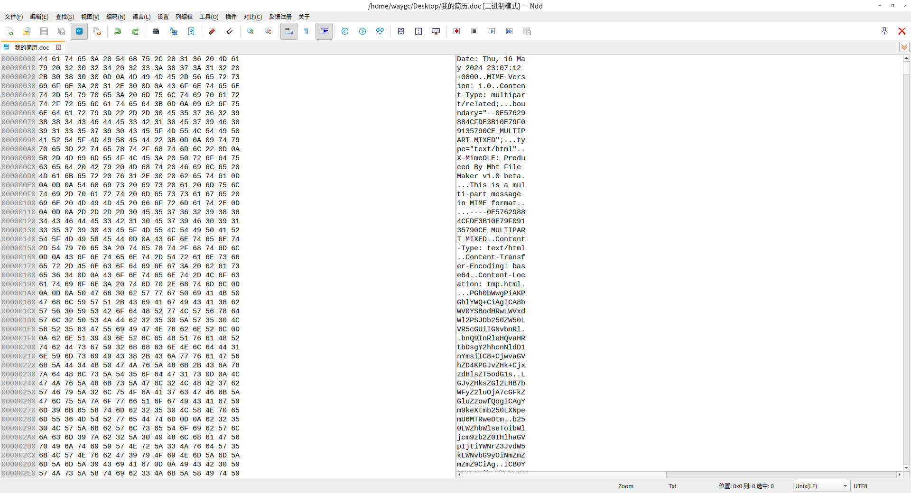

[目录](./)

# 51JOB神奇的伪word文档

这篇文章算不算是技术博客，我也知道。  
但想想也没啥好的地方可以丢，所以就算是技术博客了吧。

事情是这样的。  

最近随手刷了下简历，然后收到一些猎头小姐姐（也可能是阿姨？）的邀约，要我提供一下简历。  
于是我把不知道什么时候下到手机里的一份简历丢了过去。

但对方说手机打不开。  
我想说可能我手机里放坏了也有可能，于是说那我晚上再给你一份。  
对方说好。

然后等我晚上回家，用电脑再从 51job 上重新导出了一份 **word** 文档的发给了对方。

但对方依然说打不开。
我看自己手机上怎么看都没问题啊，只能把文件转成 pdf 发了过去，然后回家一研究惊讶到我发现 51JOB 真牛！

这就让我奇怪了。
如果说我手机里的文件可能是坏的，那我刚从 51job 上新导出的文件怎么可能也是坏的吧？

于是拿 wps 双击了一下。  
这一双击出问题了。

众所周知，我自己用的 Deepin 。  
所以，当我这一点击后，用默认打开文本文件的 `notapad--` 给打开了。  
因为第一眼看到了二进制格式，所以没仔细想就把文件关掉。  
以为把关联默认程序重新设置以下就好了。

于是右键设置那个文件的默认打开程序为 WPS 。  
此时开上去一切都很正常，直到我再次双击了另一个文本文件。

系统还是给我用了 WPS 打开！  
我懵圈了。

Linux 打开文件的逻辑不是看后缀名，而是通过文件的 `binfmt_misc` 来判断要让哪个软件来打开文件的。  
那好，既然如此，那也就是说，此时文本文件的打开方式被我设置成了 WPS ，但我又没有动过文本文件的设置。

唯一的可能，就是我操作过的那个简历文件了。

带着怀疑的态度，我把哪个简历送进了文本编辑器里。  
好家伙，这下终于暴露了。

这个所谓的“word”文档，就是一个 html 文件。  
内容还用的 base64 加密。

我估计，如果不是有意去研究，根本不会有人发现这个问题吧。