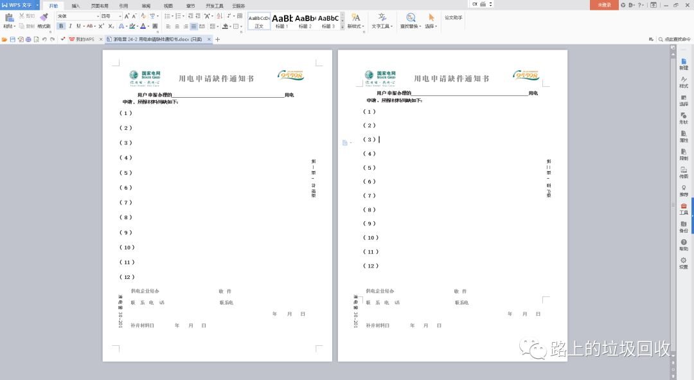
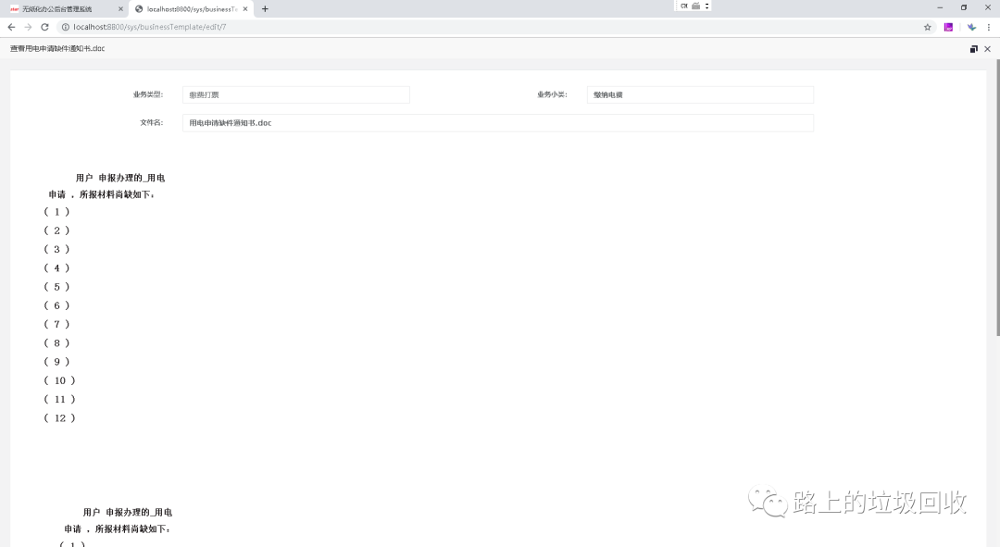
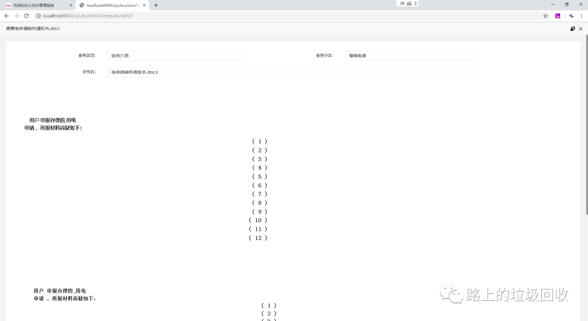
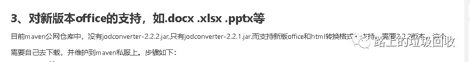
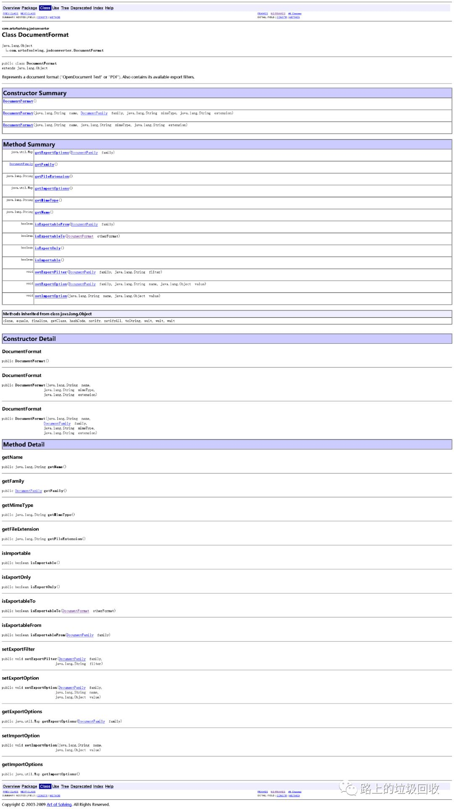
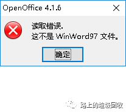
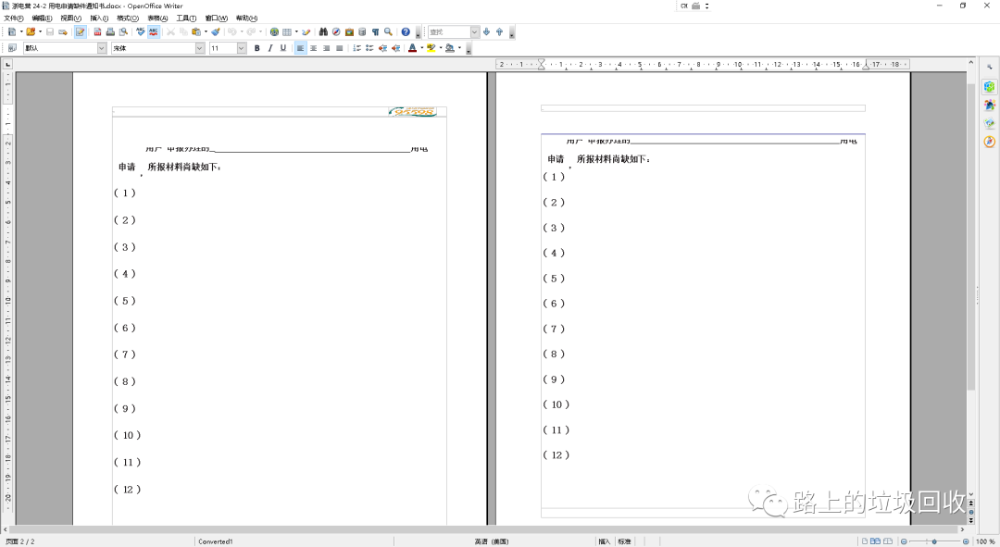
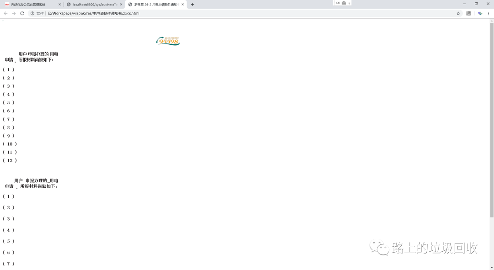
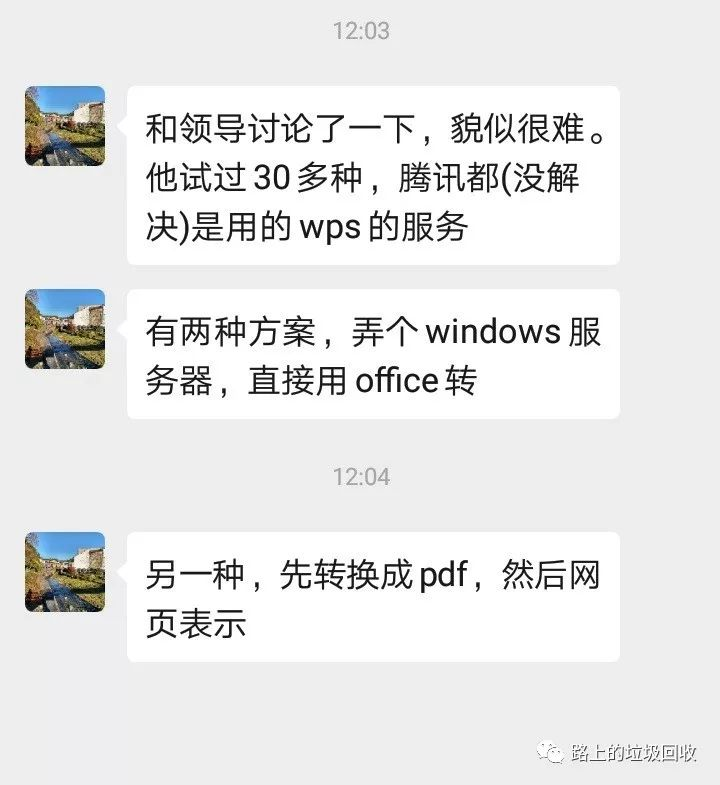

[目录](./)
# word文档转HTML的一些踩坑记录

因为某些原因，需要在浏览器中上传一个 word 文档，然后可以再其他时间、地点在线浏览这个 word 文档。  
于是，需求就变成了：如何在网页中浏览word。  
再于是，需求就变成了：怎么把word 转换成 Html格式。  
本来想着停简单的，不就找个库，然后把文件内容读取出来转换一下格式就可以了么。  
可惜理想很丰满，现实很骨感。



照着这个思路，进行了以下尝试：

### 一 mammoth.js

这个的思路最简单，导入一个`mammoth`的库，然后输入字节流就可以了。  
而且因为我在数据库中存的就是base64字符串，所以这些操作全部转移到了浏览器中。  
然后就发现，页眉页脚，以及其他的一些边边角角丢失了。  
到这时候，我还没有发现word转html是个大坑，只是简单的以为，只是单纯的这个库不行罢了。  
反正这个库也不支持.doc格式，所以换个库就换个库呗。

### 二 poi

POI自身的处理并不复杂，但处理的非常不完美，看其他人说很完美之类，也知道是怎么出来的。

我自己发现以下坑：

1. POI会将word中的图像存储到一个特定的地方，所以很容易就丢失图像；
2. POI会有版本依赖，如果处理不好，很容易出错；
3.  POI对docx的支持很差，格式错乱严重；
4. 和mammoth.js一样，页眉页脚全部丢失。

记录POM 文件的配置和 Java代码如下：
```
      <dependency>  
            <groupId>fr.opensagres.xdocreport</groupId>  
            <artifactId>fr.opensagres.xdocreport.document</artifactId>  
            <version>1.0.5</version>  
        </dependency>  
        <dependency>  
            <groupId>fr.opensagres.xdocreport</groupId>  
            <artifactId>org.apache.poi.xwpf.converter.xhtml</artifactId>  
            <version>1.0.5</version>  
        </dependency>  
        <dependency>  
            <groupId>org.apache.poi</groupId>  
            <artifactId>poi</artifactId>  
            <version>3.12</version>  
        </dependency>  
        <dependency>  
            <groupId>org.apache.poi</groupId>  
            <artifactId>poi-scratchpad</artifactId>  
            <version>3.12</version>  
        </dependency>
```
```
   public Map<String, Object> findData(Map<String, Object> params) throws Exception {  

        Map<String, Object> bizTemplateMap = businessTemplateMapper.findData(params);  

        String[] base64 = ((String) bizTemplateMap.get("fileContent")).split(",");  

        Base64.Decoder decoder = Base64.getDecoder();  
        byte[] decoderBytes = decoder.decode(base64[1]);  

        InputStream is = new ByteArrayInputStream(decoderBytes);  
        ByteArrayOutputStream os = new ByteArrayOutputStream();  

        if (base64[0].equals("data:application/vnd.openxmlformats-officedocument.wordprocessingml.document;base64")) {  
            XWPFDocument document = new XWPFDocument(is);  
            XHTMLConverter.getInstance().convert(document, os, null);  
        } else if (base64[0].equals("data:application/msword;base64")) {  

            HWPFDocument wordDocument = new HWPFDocument(is);  
            WordToHtmlConverter wordToHtmlConverter = new WordToHtmlConverter(  
                    DocumentBuilderFactory.newInstance().newDocumentBuilder().newDocument());  

            wordToHtmlConverter.processDocument(wordDocument);  
            Document htmlDocument = wordToHtmlConverter.getDocument();  
            // 这里没有加入图像处理的代码，遇到有的文档会报错  
            //也可以使用字符数组流获取解析的内容  
            //ByteArrayOutputStream baos = new ByteArrayOutputStream();  
            //OutputStream outStream = new BufferedOutputStream(baos);  
            DOMSource domSource = new DOMSource(htmlDocument);  
            StreamResult streamResult = new StreamResult(os);  
            TransformerFactory factory = TransformerFactory.newInstance();  
            Transformer serializer = factory.newTransformer();  
            serializer.setOutputProperty(OutputKeys.ENCODING,"utf-8");  
            serializer.setOutputProperty(OutputKeys.INDENT, "yes");  
            serializer.setOutputProperty(OutputKeys.METHOD, "html");  
            serializer.transform(domSource, streamResult);  
            //也可以使用字符数组流获取解析的内容  
            //String content = baos.toString();  
            //System.out.println(content);  
            //baos.close();  
            os.close();  
        }  

        bizTemplateMap.put("fileContent", os.toString());  

        return bizTemplateMap;  
    }
```

  


# 三 open office（以下简称OOo）

怎么都没有办法之后，在厕所蹲坑之际，灵感想到了为什么不用open office呢？  
专业的事情就应该让专业的人来做嘛～  
于是找到了java调用OOo服务的 jodconverter 库，再然后，就看到了下面的话……



等安装了OOo，把所有库全部折腾完，开始写代码的时候才发现，这仅仅是万里长征第一坑。
首先、这货的Javadoc和没也没什么差别了。
比如最核心的`DocumentConverter的conver`方法，有四个重载方法，Javadoc的描述如下：
```
void convert(java.io.InputStream inputStream,
        DocumentFormat inputFormat,
        java.io.OutputStream outputStream,
        DocumentFormat outputFormat)

    Convert a document.

    Note that this method does not close inputStream and outputStream.

    Parameters:
        inputStream -
        inputFormat -
        outputStream -
        outputFormat -
```
其中一个有四个参数，一看，一个是输入流，一个是输出流，很符合我的要求，我只要把输出流`toString`一下就可以完美解决我的要求了。
然后这里就要问了，这个`DocumentFormat`是什么？
于是再去看`DocumentFormat`的 javadoc。



……  
这Javadoc写和没写有区别么？

再点进去看DocumentFamily，谁能告诉我TEXT可以对应哪些文档格式？虽然猜word应该可以，但不保证不是？一旦猜错，那就得重头再来。


不断试错之后，逐渐失去了耐心，看着网上的教程，选择了下面这个重载。

```
void convert(java.io.File inputDocument,
        java.io.File outputDocument)

    Convert a document. Both input and output formats are guessed from the file extension.

    Parameters:
        inputDocument -
        outputDocument -
```

也就是说，先把字节流存成一个临时的word文档，然后读取那个word文，再把这个word文档转成html，最后再读取这个html。  
总结来说五个字：脱裤子放屁。  
不过在输入输出流怎么使都报错的情况下，这是最好的选择了，至少它把内容给转出来了，但问题也随之而来：是单独存放的。

然后，本以为终于可以填平word转html这个坑的时候，又一个新坑出现了：OOo似乎无法识别一部分的.doc格式的文档（WPS可以正常打开）。说人话就是下图。



国外情况如何不知道，但国内，兼容WPS应该是个最基本的需求，所以这错误真是蛋疼的紧。  
然后就再次发现：页眉页脚丢失的问题，还是老样子。  
而且不仅仅是输出的html有问题，直接用OOo打开，都可以看到文档的样式严重错乱，那就更不用说转了一道手的html了。



记录POM 文件的配置和 Java代码如下：
```
        <dependency>
            <groupId>com.artofsolving</groupId>
            <artifactId>jodconverter</artifactId>
            <version>2.2.2</version>
        </dependency>
        <!-- https://mvnrepository.com/artifact/org.openoffice/juh -->
        <dependency>
            <groupId>org.openoffice</groupId>
            <artifactId>juh</artifactId>
            <version>3.0.1</version>
        </dependency>
        <!-- https://mvnrepository.com/artifact/org.openoffice/ridl -->
        <dependency>
            <groupId>org.openoffice</groupId>
            <artifactId>ridl</artifactId>
            <version>3.0.1</version>
        </dependency>
        <!-- https://mvnrepository.com/artifact/org.openoffice/unoil -->
        <dependency>
            <groupId>org.openoffice</groupId>
            <artifactId>unoil</artifactId>
            <version>3.0.1</version>
        </dependency>
```
```
    public Map<String, Object> findData(Map<String, Object> params) throws Exception {  
 
        Map<String, Object> bizTemplateMap = businessTemplateMapper.findData(params);  
 
        String[] base64 = ((String) bizTemplateMap.get("fileContent")).split(",");  
 
        Base64.Decoder decoder = Base64.getDecoder();  
        byte[] decoderBytes = decoder.decode(base64[1]);  

        InputStream is = new ByteArrayInputStream(decoderBytes);  

        String[] fn = ((String) bizTemplateMap.get("fileName")).split("\\.");  
        String ext = fn[1];  

        // ------------------- OOo ------------------- //  
        File docInputFile = new File("./res/tmp_out." + ext);  
        File htmlOutputFile = new File("./res/tmp_out." + ext + ".html");  
        getInputFile(is, docInputFile);  
        OpenOfficeConnection connection = null;  
 
        try {  
            connection = new SocketOpenOfficeConnection(8100);  
            connection.connect();  
            DocumentConverter converter = new OpenOfficeDocumentConverter(connection);  
            converter.convert(docInputFile, htmlOutputFile);  
        } finally {  
//            docInputFile.delete();  
//            htmlOutputFile.delete();  
            if (connection != null) {  
                connection.disconnect();  
                connection = null;  
            }  
        }  
    } 
```



### 四 jacob
但是一看代码：

```
ActiveXComponent app = new ActiveXComponent("Word.Application");
```

嗯，ActiveX？  
再去查了一下：[https://stackoverflow.com/questions/48863500/can-we-use-jacob-jar-in-linux-env](https://stackoverflow.com/questions/48863500/can-we-use-jacob-jar-in-linux-env)  
呃……

### 五 各种在线服务

网上有些在线转换的功能，不知道能不能去申请一个服务。  
包括百度、WPS，甚至微软自己提供的服务。但这就远远超出我的权限范围了，甚至OOo都要和领导报告，让服务器装OOo不是？  
而这些乱七八糟的服务要怎么用？收费怎么算都是问题，所以暂时先放一边吧。

这里稍微提一句微软自己的在线服务。  
想起在网上翻资料的时候，看到过一眼说微软推出了一个在线编辑文档的功能。  
网站是找到了，但是

```
http://view.officeapps.live.com/op/view.aspx?src=<Document Location>
```

意思就是说：我得自己生成一个可以被公网访问到的文件，然后让微软的在线服务去调用这个文件，最后再在浏览器中浏览这个文件。

暂时还没六。  
无奈之下，和朋友吐槽了几句，然后我就觉得我的耐心还是少了点。



一句话结束这个话题：
> 过来人的意见，直接转换的话，就office自己靠谱