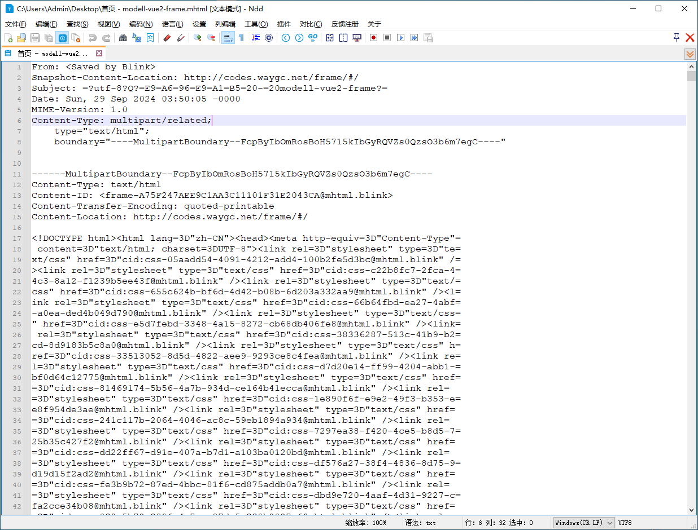

[目录](./)
# 用 MHTML 输出 MD 的文档

## 痛点

众所周知，程序员都不喜欢写文档，特别是写给客户的文档。但有些时候，这种文档还不得不写。  
而且因为客户都是 SB ，所以这些文档真是又臭又长。按照客户的想法，几乎是要把每一步操作都记录到文档中去。

而且随着功能的修改，这个文档还会经常性修改。  
所以这时候，应该很多程序员都会用 Markdown（md）来写文档。

啥，你说 Word ？

别人我不知道，至少我非常不喜欢 word 的一点就是：**太智能**。  
甚至不是有这么句话么：没有两个 word 的排版是完全一致的。

很多时候，我要做什么我自己清楚，但 word 会自作主张地加入一些它认为可以帮到我的东西。  
但大部分时候，我偏偏不需要这些帮助。

我希望做到的是：代码级的控制，而不是 word 替我决定。

什么叫代码级呢？  
简单来说，就是什么时候换行，换几行，什么时候加粗字体，等等，我都希望自己能明确掌握。  
而 word 最智能化的也就体现在了这些地方。  
或者说，这些智能的排版功能，增加了各种无用功的输出。对我来说，就称为了一个负担。  
所以大部分时候我能不用 word ，就不用 word 。

说回 md 。  
md 文档天生有个弱点，就是它的图片都是外挂的。这就非常操蛋了。

当然，可以用各种提供 md 功能的第三方软件。  
但这样一来，要把写好的文档装 U 盘里 交给其他人共享，就称为了另一种负担。  
所以最好能找个办法把 md 和外挂的图片塞一个文件里。

## 解决方案

然后在传统艺能蹲坑刷手机的时候，看到一个帖子，说可用 mhtml 云云。  
于是拉上裤子回到电脑前就开始研究。

mhtml 本身就是一个 文本文件，通过把原始 html、图片、css 等资源进行处理打包后，拼合成了有一个巨大的文件。  
但本质还是文本文件。

既然本质是文本文件，那就好办了，把 mhtml 送进文本编辑器里看看它到底长什么样。

选择了一个网页：[modell-vue2-frame](http://codes.waygc.net/frame/)，然后把它保存为 mhtml 文件。



从打开的文件内容里可以分析出来以下内容

1. mhtml 最开始有一串定义，然后根据定义一段段把内容组织了起来；
2. 所有非 ascii 码的字符，都会被转意，看起来像 html 字符的转义，但又不是， mhtml 把 `%` 改成了 `=`；
3. mhtml 会生成一个 boundary 作为分隔符使用；

以及一些非常细节的 CSS 组织方式、图片组织方式等等。

然后，就可以开始写代码了。

## 代码

首先就是把头部的内容给写出来。

```
	let output = [
		"From: <Saved by Blink>",
		`Snapshot-Content-Location:${contentLocation}`,
		`Subject: =?utf-8?Q?${subjName}?=`,
		date,
		"MIME-Version: 1.0",
		"Content-Type: multipart/related;",
		"	type=\"text/html\";",
		` boundary=${boundary}`,
		"", "" // 两个空行
	];
```

这里留了4个变量。

1. contentLocation 这个如果是在浏览器中，直接拉去浏览器地址中的值就可以了。<br />如果是非浏览器环境，那就直接赋值为 `http://localhost/`；
2. subjName 这部分从解析出来的内容来看，完全是可以自定义的，那就作为函数的输入参数吧，但需要做一个 url encode 的转换。
3. boundary 大小写字母、数字的组合，按长度拼写即可;
4. 日期，不赘述。

完成以上这些，把代码整合以下

```
function saveAsMHTML (subjName) {

	const subjName = urlEncode(subjName);
	const date = "Date: " + dayjs(new Date()).format("ddd, DD MMM yyyy hh:mm:ss +0800");
	const boundary = `----MultipartBoundary--${createBoundary()}----`;

	let output = [
		"From: <Saved by Blink>",
		`Snapshot-Content-Location:${contentLocation}`,
		`Subject: =?utf-8?Q?${subjName}?=`,
		date,
		"MIME-Version: 1.0",
		"Content-Type: multipart/related;",
		"	type=\"text/html\";",
		` boundary=${boundary}`,
		"", "" // 两个空行
	];
}

function urlEncode (input) {
	const output = [];
	for (let i = 0, len = input.length; i < len; i++) {
		let ch = input[i];
		const chCode = ch.charCodeAt(0);
		// 这里的用法来自 nodejs 的 _http_common.js 的 303-326 行（可能会随着版本不同，写法、位置都有所变化）
		// 调用函数是 ：checkInvalidHeaderChar
		if (((chCode <= 31 && chCode !== 9) || chCode > 255 || chCode === 127)) {
			ch = encodeURIComponent(ch);
			ch = ch.replaceAll("%", "=");
			output.push(ch);
		} else {
			output.push(ch);
		}
	}

	return output.join("");
}

function createBoundary () {
	// 第一位字母
	const output = [ LETTERS[Math.floor(Math.random() * 52)]] ;

	// 后面是字母+数字，合计 43 位
	for (let i = 0; i < 42; i++) {
		const ch = LETTER_DIGIT[Math.floor(Math.random() * 62)];
		output.push(ch);
	}

	return output.join("");
}

```

剩下的内容，就是按照规则，一点点组织内容了。  
基本逻辑就是先获得内容，然后一块块内容（不管是 CSS 还是 图片），全都拼接成数组，再把数组里的这些东西循环输出即可。

```
	// 图片
	const files = await Client.getFilesBase64(html, contentLocation);

	for (const file of files) {
		if (!file.base64) continue;
		const arr = [
			`--${boundary}`,
			`Content-Type: ${file.contentType}`,
			`Content-Transfer-Encoding: ${file.contentTransferEncoding}`,
			`Content-Location: ${file.name}`,
			"",
			file.base64,
			"",
		];

		output = output.concat(arr);
	}
```

唯一的问题就是图片。

如果在浏览器中还好吧，只要把所有图片都当成网络图片来处理即可。

```
const getFilesBase64 = async (html) => {
	const regx = //;
	const arr = [];

	while (true) {
		const matched = html.match(regx);
		if (matched === null) break;

		const promise = new Promise((resolve, reject) => {
			fetch(matched[2]).then(async response => {
				if (response.ok) {
					const blob = await response.blob();
					const reader = new FileReader();
					reader.readAsDataURL(blob);
					reader.onload = function (e) {
						// 文件格式：data:image/png;base64,iVBORw0KGgo...
						const { result } = e.target;
						const first = result.slice(5, 21).split(";");
						const base64Val = result.slice(22);
						resolve({name: matched[2], base64: base64Val, contentType: first[0], contentTransferEncoding: first[1]});
					}
				} else {
					reject(`HTTP 错误！状态：${response.status}`);
				}
			});
		});

		arr.push(promise);
		html = html.replace(matched[0], "");
	}

	const output = await Promise.all(arr);
	return output;
}
```

但如果是非浏览器环境则不好办，最后智能按路径来区分是网络文件、本地文件分别处理。  
等到这里，还发现 windows 下的 比如 `E:\abc.jpg` 这种方式配合的文件路径处理起来相当麻烦，  
所以也只能暂时舍弃，待后续看怎么处理。

不过 unix 式和 相对路径都没问题，那最多也就不写 windows 的  `E:\abc.jpg` 这种路径了事～

完成的代码参见 [modell-markedjs-plus](https://gitee.com/undeadway/modell-markedjs-plus/tree/master/src/modules/save-as-mhtml)

## 后续

然后，当我看到 [51JOB神奇的伪word文档](./51JOB神奇的伪word文档) 这篇记录的时候想到，我是不是还可以把输出的 mhtml 再转一层，包装成一个 类似的 伪word 文件呢？

不过这就是另外的事情了，以后再说～