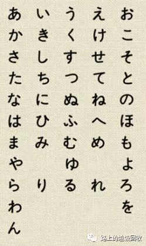
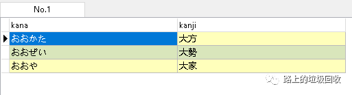
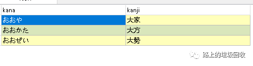
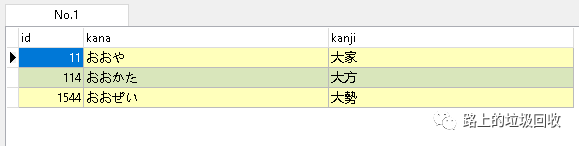

[目录](./)

# 一点国际化的小坑

在操作数据库的时候，排序是一个太常太常用到的一个功能了。  
而且经常要用到各种形式的排序，比如按姓名、按地域、按时间等等。

一般情况下，不会出现什么问题，但如果涉及到多种语言的时候，就可能会出问题。

这怎么说呢？

比如，我们要建立一个字典，有中文表，有外文表。中文按拼音顺序，外文按外文的音序排列。然后问题就产生了：外文的音序。

很简单，因为外文的排序方式是每种语言自己独有的，这种语言的排序方式可能不是数据库内置的默认，所以就得稍微花点时间来修改一下这些设置了。

这次，因为我要处理日语，所以就拿日语来举例吧。  
首先普及一点日语的基础知识。  
日语字母表叫“五十音图”，也就是下面这个东西。  
所有的日语发音都是按这张图里的字母（假名）来组合出来的。  
而日文排列顺序就叫“五十音顺”，规则是按下图从左到右，从上到下排列，并且跳过空白的位置（比如ゆ和よ中间的那个空）。



简单来说就是：先排第一行的第一个（あ），第一和的第二个（い），第一行拍完后（あいうえお），再第二行的第一个（か），第二行的第二个（き），以此类推。

首先上表结构。

```
create table t_word_jp_txt (  
"id" serial PRIMARY KEY,  
"kana" varchar(50) not null,  
"kanji" varchar(50）not null
);
```

我要处理三个日语单词：おおかた（大方，ookata）、おおや（大家，ooya）、おおぜい（大勢、oozei）。

sql如下：

```
select kana,kanji from t_word_jp_txt  
order by kana
```

如果按常理，按之前描述的按五十音顺的排列应该如下图：



但是呢，很不幸，postgres给我排列出来的顺序是：



很奇怪，我始终不明白这个顺序是怎么出来的。
`ooya`,`ookata`,`oozei`的排列顺序我怎么都想不明白，及不是拉丁字母顺，也不是日语的五十音顺。

这时候，灵光一现之下，重写了一下sql。

```
select * from t_word_jp_txt  
order by kana
```



然后我就WTF 了！  
这TM怎么还和我的输入顺序有关系，我不都按 kana 排序了咩？  
叔可忍，婶不可忍！

于是就开始调查解决方案，网上翻阅了很多，最后在 pg 的手册上找到了解决方案。

简单来说，就是为表加collation，让这个字段（或者其他）的排列顺序按某种特定的方式进行，而非 UTF默认的方式。

然后就开始了尝试。  
首先就是修改表结构。

```
create table t_word_jp_txt (  
"id" serial PRIMARY KEY,  
"kana" varchar(50) collate "ja_JP" not null,  
"kanji" varchar(50）collate "ja_JP" not null
);
```

将表重新生成以后，再一次执行sql，完美地出现了我想要的结果。  
一次成功！


东西不复杂，但主要是一个经历，而且这不仅仅是外文的时候可能用到，比如给汉字按笔画排序就也会用到，所以记录一下备忘。