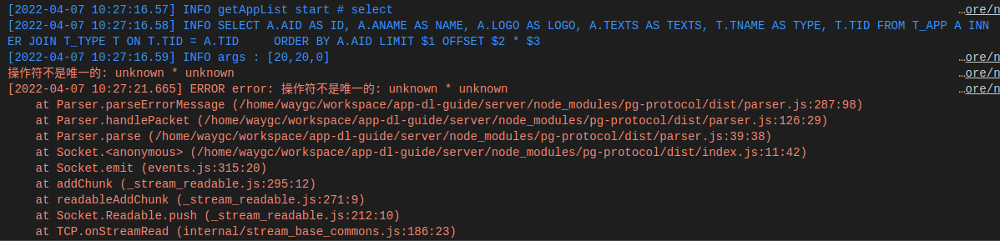
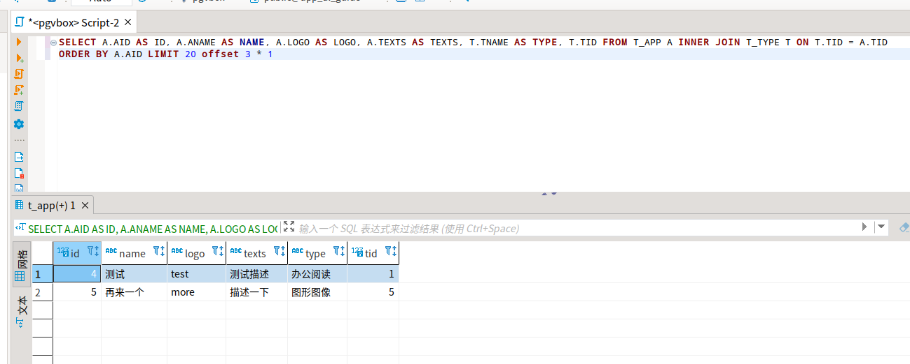
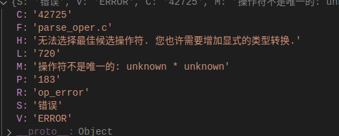

[目录](./)
# 操作符不是唯一的: unknown * unknown

写 SQL 的时候，遇到了一个很奇怪的问题，下面是原始 SQL

```
SELECT A.AID AS ID, A.ANAME AS NAME, A.LOGO AS LOGO, A.TEXTS AS TEXTS, T.TNAME AS TYPE, T.TID FROM T_APP A
INNER JOIN T_TYPE T ON T.TID = A.TID
?[hasCondition] ?[hasTid] ?[hasAnd] ?[hasTname] ORDER BY A.AID LIMIT #[count] OFFSET #[count] * #[page]
```



但如果把 SQL 直接丢到 dbeaver 里去执行，又是可以运行的。



然后就郁闷了，一时间间还以为是驱动出了什么问题。  
定位到错误的位置，一 debug 发现了问题所在。



看到这条信息，提到要进行“增加显示的类型转换”这句提示，再想到我用的是预编译形式的 SQL ，所有的变量都是字符串，那问题可能就出在 count * page 这个操作上了。
于是改了一下 SQL
```
SELECT A.AID AS ID, A.ANAME AS NAME, A.LOGO AS LOGO, A.TEXTS AS TEXTS, T.TNAME AS TYPE, T.TID FROM T_APP
A INNER JOIN T_TYPE T ON T.TID = A.TID
?[hasCondition] ?[hasTid] ?[hasAnd] ?[hasTname] ORDER BY A.AID LIMIT #[count] OFFSET #[count] :: INTEGER * #[page] :: INTEGER 
```

就 OK 了！