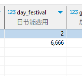
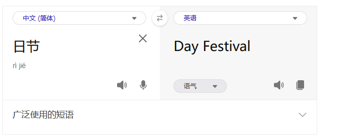

[目录](./)
# 基础设计规范

1. LESS IS MORE；
2. 所有语义必须清晰无误，不得出现模棱两可的词句；
3. 所有操作不能有隐藏条件，比如这是理所当然等云云；
4. 所有操作都要最简化处理，不能出现一步可以完成的操作硬要绕路分两步来完成；
5. 尽量不要出现叠床架屋式的设计；
6. 所有数据要做到一致性，不能出现相同或者相似含义的字段、对象指向了不同的目标；
7. 尽量不要出现数据冗余；
8. 代表同一个事物的变量名，不管在数据库、代码，或者其他什么地方，都要用同样的名词，变量名组织形式（大小写、下划线等）可以不一样，但所用到的单词必须一致，  
比如 `公司ID` 可以全部统一为 `company_id` ，不能一会儿是 `company_id` ，一会儿 `business_id` ，到时候又变成了 `firm_id` 、`corp_id` ；
9. 所有类似词的词性要一致，不能出现类似下面这样的组合 `charging <=> discharge` ；
10. 所有翻译要过一遍脑子，不能出现如下的翻译。  ；