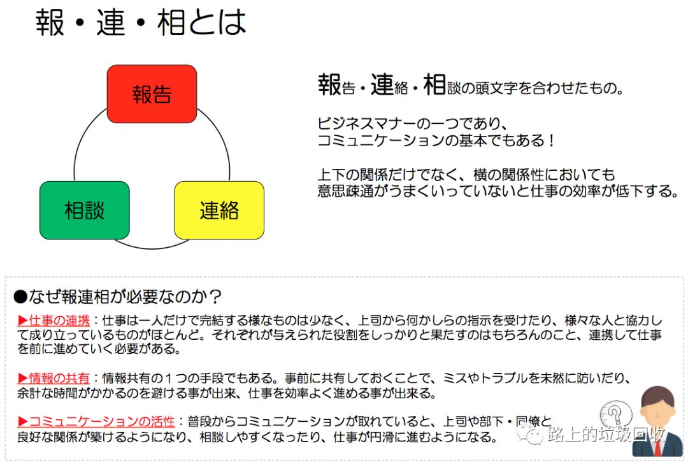

[目录](./)

# 记一次失败的项目统筹管理

事情是这样的：

> 因为某些原因，接下了一个非常小的小项目（私活）。主要就是为一个朋友开发一个投票系统。  
> 然后对于投票数据的导入和管理，决定采用C# 写一个客户端来搞定。  
> 和客户端的开发人员谈妥之后，基本确定一周报告一次的制度等等。  
> 但当我第三周询问进度，并且要代码的时候，出问题了。  
> 对方回我说：我来不及了，我怕影响你，我退出了。  
> 大囧！

因为整个项目较小，整个功能实现也较为简单，所以整体影响并不大，但还是觉得有些问题，还是得记录一下，反省一下原因。  
首先，原因是两方面的。开发人员身上，或许存在着对项目不熟悉、对整体流程不熟悉等扥问题，但最为一个管理方，这些本来就是需要注意的地方，所以管理方的责任和不可忽视。

然后稍作分析可以发现有这些问题：

## 1. 文档的不明确

开发人员是首次参与这种项目。虽然最开始已经明确说明了使用的工具、工作方式等等，而且自认为文档写的也比较完善。  
但毕竟不能把所有问题交给文档。有些时候文档上虽然已经写了，但因为不同的人可能会有理解偏差，所以最好还是能做到对文档的交流询问。  
比如某些工具是不是会用，文档是不是看过等等。

这里我引用一句自己经常说的话
> 你的理所当然，不是我的理所当然。

日常工作因为处于同一个办公环境，且天天见面有什么问题可以随时发现，问题不大。  
但现在处于网络开发，所以一旦沟通不畅，就可能出现大量的问题堆积而不自觉。然后就会因为没有及时跟进掌握的情况，只是每周例行询问一次造成了开发者和管理者的脱节。

## 2. 工具的不明确

这次的主要问题就在于开发人员似乎似乎没有“工程”的概念。我把客户端工程交给了他，但他在提交代码的时候，只提交了一个文件，而不是把整个工程。而且从中还能看出，他是直接在网页上操作，而不是使用了专门的工具。

而背后所反映的，就是对开发工具的陌生。虽然面谈的时候，已经了解到开发人员对开发流程、工具、语言都不熟悉，本来就是抱着学习的心态来的，但越是如此，就更应该去多了解一下开发人员的现状。
不过，话又说回来，某些工具的使用并不是靠微信上几行交流就能看出使用水平的。如果最后提交代码不对，那风险系数就太高了。所以这时候就更需要对开发人员的技术水平有深刻的把握才行。

具体的原因是以上两个，但总结起来基本上就可以说是一个：沟通不足。

因为我是对日软件出身，所以马上就联想到在对日开发的地方，经常会听到一个名词：報連相，这个词就是报告、联（连）络、相谈的缩写。

顾名思义，就是要做到报告、联络和相谈。简单来说，就是这样的作业流程：

1. 做项目，特别是有自己不熟悉的开发工具、环境、作业方式的时候，首先把既有的项目文档全部看掉，然后再根据项目文档来干活，不要自己瞎猜。  
2. 当有问题的时候，马上向自己的负责人、项目经理等人进行报告和联络，请教相关情况。
3. 最后和相关的人士进行相谈，看看问题应该怎么处理。

报告上虽然我要求一周一次，但对于报告我却没仔细确认。联络和相谈基本就没有了。  
所以失败也就在所难免了。

那解决方案呢？

这种情况下，应该让开发人员在第一时间把代码提交上来，然后虽然有些繁琐，但最好能每天确认一次提交，哪怕只修改了一个字母。  
如果能事先说明情况，要求将整个工程都提交上来，或者在服务器上事先架构好一个框架，那就会比让开发人员自己去猜要好得多。  
比如我问开发人员在干什么，他回答在看C#的视频，然后就没了。可这时候我该继续问：看的什么视频，有什么成果。这才能判断出学习的效果如何。

因为我这次是一个非常小的项目，甚至我也不要求C#技术有多NB，差不多够用就可以了。所以作为一个有着Java经验的IT人，不需要从0开始学起，拿着VS稍微玩几下之后直接上手写代码就可以了，有些时候，甚至不需要去熟悉C#的相关知识，照着JAVA的来也完全OK。

如果是猪八戒或者其他哪儿的老司机，并不需要太过去强调这些，因为这些是理所当然的。可是就像以前我对别人说过的一句话一样：你的理所当然，对我而言不是理所当然。所以虽然繁琐，有些时候，还是得去详细说明一下相关的内容。